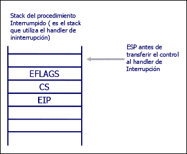
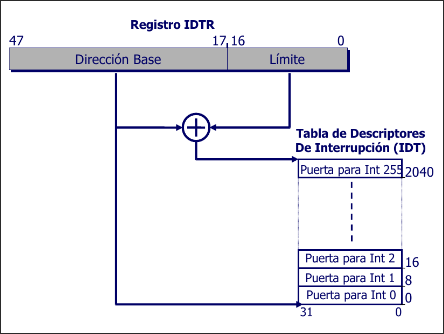

# Interrupciones

## Table of Content
* [Definiciones](#interrupciones-definiciones)
* [Tipos de Interrupciones](#tipos-de-interrupciones)
* [Tipos de Excepciones](#tipos-de-excepciones)
* [Implementacion](#implementacion)
    + [Estado de la pila](#estado-de-la-pila)
        - [Pila sin error code](#pila-sin-error-code)
        - [Pila con error code](#pila-con-error-code)
        - [Copia del Stack Usuario al Stack Kernel](#copia-del-stack-usuario-al-stack-kernel)
    + [Estructura de la IDT](#estructura-de-la-IDT)
        - [Descriptor de Interrupciones](#descriptor-de-interrupciones)
    + [Esquema general](#esquema-general)

## Interrupciones: Definiciones
- Conceptualmente permite a un agente externo o interno solicitar la interrupcion de la ejecucion actual para atender un pedido
- La parte solicitante ve al procesador como un recurso al cual quiere tener acceso
- El mecanismo implementado **define una identidad numerica para cada interrupcion** y utiliza una tabla de descriptores donde cada indice, o identidad, se decide:
    * Donde se encuentra la rutina que lo atiende (direccion de memoria)
    * En que contexto se va a ejecutar (segmento y nivel de privilegio)
    * De que tipo de interrupcion se trata

## Tipos de Interrupciones
- **Excepciones** que van a ser generadas por el procesador cuando se cumpla una condicion
- **Interrupciones**
    * **Externas**, cuyo origen se da en un dispositivo externo (reloj y teclado)
    * **Internas**, cuyo origen se da en una llamada a la instruccion `INT` por parte de un proceso

## Tipos de Excepciones
- **Fault**, excepcion que podria corregirse para que el programa continue su ejecucion. El procesador guarda en la pila la direccion de la instruccion que produjo la falla
- **Traps**, excepcion producida al terminar la ejecucion de una instruccion de trap. El procesador guarda en la pila la direccion de la instruccion a ejecutarse luego de la que causo el trap
- **Aborts**, excepcion que no siempre puede determinar la instruccion que la causa, ni permite recuperar la ejecucion de la tarea que la causo. Reporta errores severos de hardware o inconsistencias en tablas del sistema

## Implementacion
- Escribir la rutina de atencion de cada excepcion/interrupcion (`IRET`)
- Definir la *IDT* con los descriptores correspondientes
- Cargar nuestro descriptor de *IDT* en `IDTR`

### Estado de la pila
Antes de atender una excepcion/interrupcion, el procesador pushea en la pila
- `EFLAGS`
- `CS`
- `EIP`
- En algunas excepciones tambien un error code

#### Pila sin error code

#### Pila con error code
Si la excepcion o la interrupcion se ha producido en medio del codigo de una aplicacion (modo user), sera el kernel quien tome control.
Si se genero en codigo del kernel, queda en el kernel

- `EXT`
    * *External Event*
    * Se setea para indicar que al excepcion ha sido causada por un evento externo al procesador
- `IDT`
    * Descriptor Location
    * `IDT = 0`, los bits 15:3 indican el descriptor de la tarea actual
- `TI`
    * `IDT = 0`
        + `TI = 0`, indican a una GDT
        + `TI = 1`, indican a una LDT

##### Copia del Stack Usuario al Stack Kernel

### Estructura de la IDT

#### Descriptor de Interrupciones

- `Offset`, va a ser la direccion de memoria donde comienza la rutina de atencion de interrupcion
- `Segment selector`, indica que selector debe utilizarse al ejecutar el codigo de la rutina
- `P`, indica si la rutina se encuentra en memoria o no
- `DPL`, indica el nivel de privilegio

### Esquema general

