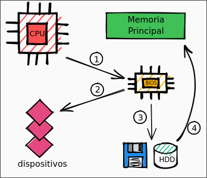
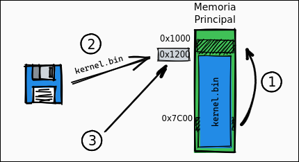
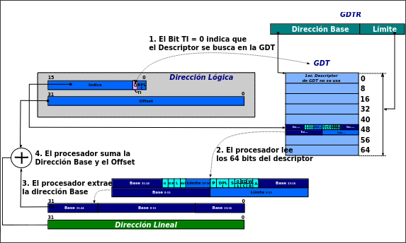

# Modo Real, Modo Protegido

## Table of Content
* [Propiedades](#propiedades)
* [Pasaje a Modo Protegido](#pasaje-a-modo-protegido)
    + [Bootloader comun](#comun)
    + [Bootloader Orga2](#orga2)
    + [Segmentacion](#segmentacion)
        - [Selector de Segmentos](#selector-de-segmentos)
        - [Descriptor de Segmentos](#descriptor-de-segmentos)
        - [Tipos de Descriptores de Datos](#tipos-de-descriptores-de-dato-)
        - [Tipos de Descriptores de Codigo](#tipos-de-descriptores-de-codigo-)
    + [GDT](#gdt)
        - [Direccion Logica a Direccion Virtual](#direccion-logica-a-direccion-lineal)
        - [LDT](#ldt)

## Propiedades

| Modos | Bits | Memoria | Privilegios | Interrupciones | Instrucciones |
| :---: | :--: | :-----: | :---------: | :------------: | :-----------: |
| Real | 16 | 1 MB | - | Rutinas de atencion | Todas |
| Protegido | 32 | 4 GB | 4 niveles | Rutinas de atencion con privilegios | Depende del privilegio |

## Pasaje a Modo Protegido

### Requisitos
- Bootloader
- `GDT`
- Desabilitar interrupciones
- Cargar en `GDTR` la direccion base de la `GDT`
- Setear el bit `PE` del registro `CR0`
- `jmp far` a la siguiente instruccion
- Cargar los selectores de segmento

### Bootloader

#### Comun
1. CPU ejecuta codigo residente en memoria flash de BIOS
2. BIOS ejecuta POST en los dispositivos
3. BIOS busca un dispositivo booteable
4. Se copia a memoria principal en la posicion `0x7C00` el sector de booteo (512 bytes)

#### Orga2
1. Se copia el bootloader a la posicion `0x1000`
2. Busca y carga el archivo `kernel.bin` contenido en el diskette y lo copia en la direccion `0x1200`
3. Se salta hacia la direccion `0x1200` y se ejecuta desde ahi

### Segmentacion

#### Selector de Segmentos

- `Index` (bits 15 - 13)
    * Es el indice en la Tabla de Descriptores
    * Puede alojar hasta 213 descriptores
- `TI` *Table Indicator* (bit 2)
    * Indica a que tabla se tiene que dirigir el Selector de Segmento
        + `TI = 0`, **GDT** (Global Descriptor Table) :point_left:
        + `TI = 1`, **LDT** (Local Descriptor Table)
- `RPL` *Requested Priviledge Level* (bits 1 - 0)
    * Es el nivel de privilegio que declara tener el dueño del segmento.
        + `RPL = 00`, :sunglasses:
        + `RPL = 11`, :nerd_face:

##### Tipos de Selectores de Segmentos

| Segmento | Acceso |
| :------: | :----: |
| `CS` | Codigo |
| `SS` | Pila |
| `DS` | Datos (default) |
| `ES` | Datos |
| `FS` | Datos |
| `GS` | Datos |

#### Descriptor de Segmentos

- `Base Address`
    * Es la direccion a partir de la cual se despliega en forma continua el segmento
- `Segment Limit`
    * Especifica el maximo offset que puede tener un byte direccionable dentro del segmento
    * Es el tamaño del segmento menos 1
- `G` *Granularity*
    * Establece la unidad de medida del `Segment Limit`
        + `G = 0`, el maximo offset de un byte es igual al `Segment Limit`
        + `G = 1`, el maximo offset es igual a `Segment Limit * 0x1000 + 0xFFF` :point_left:
- `D/B` *Default/Big*
    * Configura el tamaño de los segmentos
        + `D/B = 0`, el segmento es de 16 bits
        + `D/B = 1`, el segmento es de 32 bits :point_left:
- `L`
    * Verifica si el segmento de codigo tiene un tamaño de 64 bits
        + Solamente lo mira cuando el CPU esta en modo `IA-32e` (x64)
        + `L = 0` :point_left:
- `AVL` *Available*
    * Es un bit que queda para el programador
        + `AVL = 0` :point_left:
- `P` *Present*
    * Indica en que parte de la memoria se encuentra el segmento 
        + `P = 1`, el segmento correspondiente esta presente en la memoria RAM :point_left:
        + `P = 0`, el segmento esta en la memoria virtual (disco)
- `DPL` *Descriptor Priviledge Level*
    * Nivel de privilegio que debe tener el segmento que contiene el codigo que pretende acceder a este segmento
        + `DPL = 00`, :sunglasses:
        + `DPL = 11`, :nerd_face:
- `S` *System*
    * `S = 0`, adminstra los segmentos de Sistema
    * `S = 1`, adminstra los segmentos de Codigo/Datos :point_left:

##### Tipos de Descriptores de Dato (`S = 0`)

| Decimal | 11 | 10 (`E`) | 9 (`W`) | 8 (`A`) | Descripcion |
| :-----: | :-: | :-----: | :-----: | :-----: | :---------: |
| 0       | 0  | 0        | 0       | 0       | Read-Only   |
| 1       | 0  | 0        | 0       | 1       | Read-Only, Accessed |
| 2       | 0  | 0        | 1       | 0       | Read/Write  |
| 3       | 0  | 0        | 1       | 1       | Read/Write, Accessed |
| 4       | 0  | 1        | 0       | 0       | Read-Only, Expand-down |
| 5       | 0  | 1        | 0       | 1       | Read-Only, Expand-down, Accessed |
| 6       | 0  | 1        | 1       | 0       | Read/Write, Expand-down |
| 7       | 0  | 1        | 1       | 1       | Read/Write, Expand-down, Accessed |

##### Tipos de Descriptores de Codigo (`S = 1`)

| Decimal | 11 | 10 (`C`) | 9 (`R`) | 8 (`A`) | Descripcion |
| :-----: | :-: | :-----: | :-----: | :-----: | :---------: |
| 8       | 1  | 0        | 0       | 0       | Execute-Only   |
| 9       | 1  | 0        | 0       | 1       | Execute-Only, Accessed |
| 10      | 1  | 0        | 1       | 0       | Execute/Read  |
| 11      | 1  | 0        | 1       | 1       | Execute/Read, Accessed |
| 12      | 1  | 1        | 0       | 0       | Execute-Only, Conforming |
| 13      | 1  | 1        | 0       | 1       | Execute-Only, Conforming, Accessed |
| 14      | 1  | 1        | 1       | 0       | Execute/Read, Conforming |
| 15      | 1  | 1        | 1       | 1       | Execute/Read, Conforming, Accessed |

Significados de los bits de `Types`
- `C` *Conforming*
    * Ajuntan su nivel de privilegio al del codigo que los ha invocado
    * Permiten que un segmento de codigo pueda ser invocado desde otro segmento de codigo menos privilegiado mediante, por ejemplo, una instruccion `CALL` a una subrutina residente en este segmento
- `R` *Readable*
    * `R = 0`, las direcciones de memoria residente en el segmento son de ejecucion
    * `R = 1`, habilita la lectura de direcciones de memoria residente en el segmento
- `E` *Expand-Down*
    * Cuando el segmento de datos va a ser utilizado como Pila, puede optarse por tratarlo como un segmento comun de datos.
    * Pone de manifiesto que es una Pila y su puntero de direcciones decrece hacia las direcciones de memoria numericamente menores a medidda que se expande el segmento.
- `W` *Writable*
    * `W = 0`, solamente puede leerse el segmento de datos
    * `W = 1`, habilita la escritura del segmento de datos
- `A` *Accessed*
    * Se setea cada vez que se accede una direccion en el segmento

### `GDT`

#### Direccion Logica a Direccion Lineal

1. El procesador evalua el estado del `TI` (bit 2) del [selector de segmentos](#selector-de-segmentos) y en caso de que `TI = 0`, el procesador asume que buscara el descriptor en la **GDT**
2. El registro **GDTR** del procesador contiene la *direccion base* que indica en donde comienza la **GDT** y un *limite* que indica la cantidad de descritores almacena
3. El valor `n` contenido por los 13 bits del campo `Index` del [selector de segmentos](#selector-de-segmentos), referencia al n-esimo elemento de la tabla **GDT**
4. El procesador accede a la direccion de *memoria fisica* dada por `GDT.Base + 8 * Index` y lee 8 bytes (64 bits) a partir de ella, es decir, busca el [descriptor de segmentos](#descriptor-de-segmentos) correspondiente
5. Una vez leido el [descriptor de segmentos](#descriptor-de-segmentos), internamente reordena la *direccion base* y el *limite* y agrupa los *Atributos*
6. La Unidad de Proteccion verifica que el offset contenido en el registro correspondiente de la *direccion logica* corresponda al rango de offsets validos del segmento de acuerdo al valor del campo *limite* y de los bits de *Atributos* `G`, `D/B` y `ED`
7. La Unidad de Proteccion chequea que la operacion a realizarse en el segmento se corresponda con los bits de *Atributos* `R` y `C`, si es de codigo, `W` si es de datos, que el codigo de acceso tenga los privilegios necesarios de acuerdo a los bits `DPL` del descriptor, que `P = 1`, entre los mas comunes
8. Si todo esta de manera correcta, el procesador suma el valor de offset contenido en la *direccion logica*, con la *direccion base* del segmento y conforma la *direccion lineal*

#### `LDT`

