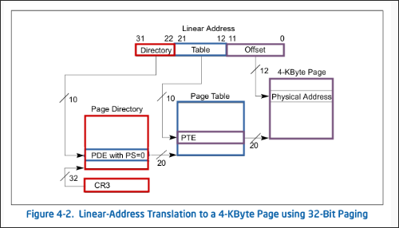
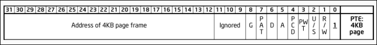

# Paginacion

## Table of Content
* [Definiciones](#paginacion-definiciones)
* [Traduccion de direcciones virtuales](#traduccion-de-direcciones-virtuales)
    + [CR3](#cr3)
    + [Page Directory Entry](#page-directory-entry)
    + [Page Table Entry](#page-table-entry)
* [Translation Lookaside Buffer](#translation-lookaside-buffer)
* [Segmentacion + Paginacion](#segmentacion--paginacion)

## Pagincacion: Definiciones
La funcion de la paginacion es la de traducir una direccion virtual en una direccion fisica. Esta traduccion permite separar el espacio de direcciones expuestas al proceso *direcciones virtuales* de su ubicacion en la memoria fisica (*direcciones fisicas* en la memoria principal).

Dividir el espacio de *direcciones virtuales* del espcacio fisico tiene la ventaja de poder separar el espacio de distintos procesos que se ejecutan sobre el mismo procesador y por ende comparten una misma memoria principal. 

## Traduccion de direcciones virtuales
En la direccion virtual, encontraremos las herramientas necesarias para encontrar la pagina de 4K que necesitamos.
La misma se divide en tres partes

| Nombre | Extended | Definicion | Bits |
| :----: | :------: | :--------: | :--: |
| `PD_Index` | *PageDirectory_Index* | Indice dentro del **Page Directory** donde se encuentra la ubicacion del **Paga Table** | 31:22 |
| `PT_Index` | *PageTable_Index* | Indice dentro del **Paga Table** donde se encuentra la ubicacion del **Page Frame** | 21:12 |
| `Page_Offset` | *Page_Offset* | Desplazamiento desde la base de la pagina donde se encuentra el dato esperado | 11:0 |

### CR3

- `Address of page directory` (bits 31 - 12)
    * Direccion donde se encuentra el **Page Directory**
    * Direccion del **Page Directory**: `CR3 & 0xFFFFF000`
- `PCD` *Page-Level Cache Disable* (bit 4)
    * Establece que una pagina integre el tipo de memoria no cacheable
        + `PCD = 0` :point_left:
- `PWT` *Page-Level Write Through* (bit 3)
    * Establece el modo de escritura que tendra la pagina en el Cache
        + `PWT = 0` :point_left:

### Page Directory Entry

- `Address of page table` (bits 31 - 12)
    * Direccion donde se encuentra el **Page Table**
    * Direccion del i-esima **Page Table**: `pd[i] & 0xFFFFF000`
- `PS` *Page Size* (bit 7)
    * `PS = 0` :point_left:
        + La **Page Directory Entry** corresponde a una **Page Table** de 4K
    * `PS = 1`
        + La **Page Directory Entry** corresponde a una **Page Table** de 4M
- `A` *Accessed* (bit 5)
    * Se setea cada vez que la pagina es accedida
    * Se limpia por software
- `U/S` *User/Supervisor* (bit 2)
    * Privilegio de la pagina
        + `U/S = 0` :sunglasses:
        + `U/S = 1` :nerd_face:
- `R/W` *Readable/Writable* (bit 1)
    * `R/W = 0`, Read-Only
    * `R/W = 1`, Read/Write

### Page Table Entry

- `Address of 4K page frame` (bits 31 - 12)
    * Direccion donde se encuentra el **Page Frame**
    * Direccion de la i-esima **Page Frame**: `pt[i] & 0xFFFFF000`
- `G` *Global* (bit 7)
    * Si el bit `CR4.PGE = 1`, la entrada no se flushea cuando se recarga el registro `CR3`
- `D` *Dirty* (bit 6)
    * Es seteado por unidad de memoria del procesador cuando se escribe en la pagina
    * Se limpia por software
- `P` *Present* (bit 0)
    * Indica si la pagina se encuetra en memoria (`P = 1`) o no (`P = 0`)

## Translation Lookaside Buffer
Almacena las ultimas traducciones realizadas para no tener que volver a computarlas.
Cuando se realiza un cambio en la estructura de paginacion, es necesario forzar una limpieza del mismo para evitar que las direcciones pre-computadas que ya no son validas se sigan empleando, para esto realizamos un intercambio del registro `CR3` con un valor temporal y luego lo restauramos

## Segmentacion + Paginacion

