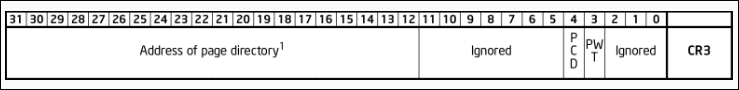
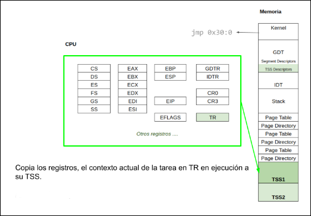

# System Programming

## Table of Content
- [Modo Real, Modo Protegido](#modo-real-modo-protegido)
    * [Propiedades](#propiedades)
    * [Pasaje a Modo Protegido](#pasaje-a-modo-protegido)
        + [Bootloader comun](#comun)
        + [Bootloader Orga2](#orga2)
        + [Segmentacion](#segmentacion)
            - [Selector de Segmentos](#selector-de-segmentos)
            - [Descriptor de Segmentos](#descriptor-de-segmentos)
            - [Tipos de Descriptores de Datos](#tipos-de-descriptores-de-dato-)
            - [Tipos de Descriptores de Codigo](#tipos-de-descriptores-de-codigo-)
        + [GDT](#gdt)
            - [Direccion Logica a Direccion Virtual](#direccion-logica-a-direccion-lineal)
            - [LDT](#ldt)
    * [Codigo](#pasaje-a-modo-protegido-codigo)
- [Interrupciones](#interrupciones)
    * [Definiciones](#interrupciones-definiciones)
    * [Tipos de Interrupciones](#tipos-de-interrupciones)
    * [Tipos de Excepciones](#tipos-de-excepciones)
    * [Implementacion](#implementacion)
        + [Estado de la pila](#estado-de-la-pila)
            - [Pila sin error code](#pila-sin-error-code)
            - [Pila con error code](#pila-con-error-code)
            - [Copia del Stack Usuario al Stack Kernel](#copia-del-stack-usuario-al-stack-kernel)
        + [Estructura de la IDT](#estructura-de-la-IDT)
            - [Descriptor de Interrupciones](#descriptor-de-interrupciones)
        + [Esquema general](#esquema-general)
    * [Codigo](#interrupciones-codigo)
- [Paginacion](#paginacion)
    * [Definiciones](#paginacion-definiciones)
    * [Traduccion de direcciones virtuales](#traduccion-de-direcciones-virtuales)
        + [CR3](#cr3)
        + [Page Directory Entry](#page-directory-entry)
        + [Page Table Entry](#page-table-entry)
    * [Translation Lookaside Buffer](#translation-lookaside-buffer)
    * [Segmentacion + Paginacion](#segmentacion--paginacion)
    * [Codigo](#paginacion-codigo)
- [Tareas](#tareas)
    * [Definiciones](#tareasdefiniciones)
    * [Estructura](#estructura)
        + [TSS](#tss)
        + [TSS Descriptor](#tss-descriptor)
    * [Task Switch](#task-switch)
        + [Como hacer un Task Switch?](#como-hacer-un-task-switch)
        + [Rutina de atencion de Interrupciones del Reloj](#rutina-de-atencion-de-interrupciones-del-reloj)
        + [Nivel de Privilegios en Tareas](#niveles-de-privilegios-en-tareas)
    * [Codigo](#tareas-codigo)
- [Overall](#overall)

# Modo Real, Modo Protegido

## Propiedades

| Modos | Bits | Memoria | Privilegios | Interrupciones | Instrucciones |
| :---: | :--: | :-----: | :---------: | :------------: | :-----------: |
| Real | 16 | 1 MB | - | Rutinas de atencion | Todas |
| Protegido | 32 | 4 GB | 4 niveles | Rutinas de atencion con privilegios | Depende del privilegio |

## Pasaje a Modo Protegido

### Requisitos
- Bootloader
- `GDT`
- Desabilitar interrupciones
- Cargar en `GDTR` la direccion base de la `GDT`
- Setear el bit `PE` del registro `CR0`
- `jmp far` a la siguiente instruccion
- Cargar los selectores de segmento

### Bootloader

#### Comun
1. CPU ejecuta codigo residente en memoria flash de BIOS
2. BIOS ejecuta POST en los dispositivos
3. BIOS busca un dispositivo booteable
4. Se copia a memoria principal en la posicion `0x7C00` el sector de booteo (512 bytes)


#### Orga2
1. Se copia el bootloader a la posicion `0x1000`
2. Busca y carga el archivo `kernel.bin` contenido en el diskette y lo copia en la direccion `0x1200`
3. Se salta hacia la direccion `0x1200` y se ejecuta desde ahi


### Segmentacion

#### Selector de Segmentos


- `Index` (bits 15 - 13)
    * Es el indice en la Tabla de Descriptores
    * Puede alojar hasta 2<sup>13</sup> descriptores
- `TI` *Table Indicator* (bit 2)
    * Indica a que tabla se tiene que dirigir el Selector de Segmento
        + `TI = 0`, **GDT** (Global Descriptor Table) :point_left:
        + `TI = 1`, **LDT** (Local Descriptor Table)
- `RPL` *Requested Priviledge Level* (bits 1 - 0)
    * Es el nivel de privilegio que declara tener el dueño del segmento.
        + `RPL = 00`, :sunglasses:
        + `RPL = 11`, :nerd_face:

##### Tipos de Selectores de Segmentos

| Segmento | Acceso |
| :------: | :----: |
| `CS` | Codigo |
| `SS` | Pila |
| `DS` | Datos (default) |
| `ES` | Datos |
| `FS` | Datos |
| `GS` | Datos |

#### Descriptor de Segmentos


- `Base Address`
    * Es la direccion a partir de la cual se despliega en forma continua el segmento
- `Segment Limit`
    * Especifica el maximo offset que puede tener un byte direccionable dentro del segmento
    * Es el tamaño del segmento menos 1
- `G` *Granularity*
    * Establece la unidad de medida del `Segment Limit`
        + `G = 0`, el maximo offset de un byte es igual al `Segment Limit`
        + `G = 1`, el maximo offset es igual a `Segment Limit * 0x1000 + 0xFFF` :point_left:
- `D/B` *Default/Big*
    * Configura el tamaño de los segmentos
        + `D/B = 0`, el segmento es de 16 bits
        + `D/B = 1`, el segmento es de 32 bits :point_left:
- `L`
    * Verifica si el segmento de codigo tiene un tamaño de 64 bits
        + Solamente lo mira cuando el CPU esta en modo `IA-32e` (x64)
        + `L = 0` :point_left:
- `AVL` *Available*
    * Es un bit que queda para el programador
        + `AVL = 0` :point_left:
- `P` *Present*
    * Indica en que parte de la memoria se encuentra el segmento 
        + `P = 1`, el segmento correspondiente esta presente en la memoria RAM :point_left:
        + `P = 0`, el segmento esta en la memoria virtual (disco)
- `DPL` *Descriptor Priviledge Level*
    * Nivel de privilegio que debe tener el segmento que contiene el codigo que pretende acceder a este segmento
        + `DPL = 00`, :sunglasses:
        + `DPL = 11`, :nerd_face:
- `S` *System*
    * `S = 0`, adminstra los segmentos de Sistema
    * `S = 1`, adminstra los segmentos de Codigo/Datos :point_left:

##### Tipos de Descriptores de Dato (`S = 0`)

| Decimal | 11 | 10 (`E`) | 9 (`W`) | 8 (`A`) | Descripcion |
| :-----: | :-: | :-----: | :-----: | :-----: | :---------: |
| 0       | 0  | 0        | 0       | 0       | Read-Only   |
| 1       | 0  | 0        | 0       | 1       | Read-Only, Accessed |
| 2       | 0  | 0        | 1       | 0       | Read/Write  |
| 3       | 0  | 0        | 1       | 1       | Read/Write, Accessed |
| 4       | 0  | 1        | 0       | 0       | Read-Only, Expand-down |
| 5       | 0  | 1        | 0       | 1       | Read-Only, Expand-down, Accessed |
| 6       | 0  | 1        | 1       | 0       | Read/Write, Expand-down |
| 7       | 0  | 1        | 1       | 1       | Read/Write, Expand-down, Accessed |

##### Tipos de Descriptores de Codigo (`S = 1`)

| Decimal | 11 | 10 (`C`) | 9 (`R`) | 8 (`A`) | Descripcion |
| :-----: | :-: | :-----: | :-----: | :-----: | :---------: |
| 8       | 1  | 0        | 0       | 0       | Execute-Only   |
| 9       | 1  | 0        | 0       | 1       | Execute-Only, Accessed |
| 10      | 1  | 0        | 1       | 0       | Execute/Read  |
| 11      | 1  | 0        | 1       | 1       | Execute/Read, Accessed |
| 12      | 1  | 1        | 0       | 0       | Execute-Only, Conforming |
| 13      | 1  | 1        | 0       | 1       | Execute-Only, Conforming, Accessed |
| 14      | 1  | 1        | 1       | 0       | Execute/Read, Conforming |
| 15      | 1  | 1        | 1       | 1       | Execute/Read, Conforming, Accessed |

Significados de los bits de `Types`
- `C` *Conforming*
    * Ajuntan su nivel de privilegio al del codigo que los ha invocado
    * Permiten que un segmento de codigo pueda ser invocado desde otro segmento de codigo menos privilegiado mediante, por ejemplo, una instruccion `CALL` a una subrutina residente en este segmento
- `R` *Readable*
    * `R = 0`, las direcciones de memoria residente en el segmento son de ejecucion
    * `R = 1`, habilita la lectura de direcciones de memoria residente en el segmento
- `E` *Expand-Down*
    * Cuando el segmento de datos va a ser utilizado como Pila, puede optarse por tratarlo como un segmento comun de datos.
    * Pone de manifiesto que es una Pila y su puntero de direcciones decrece hacia las direcciones de memoria numericamente menores a medidda que se expande el segmento.
- `W` *Writable*
    * `W = 0`, solamente puede leerse el segmento de datos
    * `W = 1`, habilita la escritura del segmento de datos
- `A` *Accessed*
    * Se setea cada vez que se accede una direccion en el segmento

### `GDT`


#### Direccion Logica a Direccion Lineal

1. El procesador evalua el estado del `TI` (bit 2) del [selector de segmentos](#selector-de-segmentos) y en caso de que `TI = 0`, el procesador asume que buscara el descriptor en la **GDT**
2. El registro **GDTR** del procesador contiene la *direccion base* que indica en donde comienza la **GDT** y un *limite* que indica la cantidad de descritores almacena
3. El valor `n` contenido por los 13 bits del campo `Index` del [selector de segmentos](#selector-de-segmentos), referencia al n-esimo elemento de la tabla **GDT**
4. El procesador accede a la direccion de *memoria fisica* dada por `GDT.Base + 8 * Index` y lee 8 bytes (64 bits) a partir de ella, es decir, busca el [descriptor de segmentos](#descriptor-de-segmentos) correspondiente
5. Una vez leido el [descriptor de segmentos](#descriptor-de-segmentos), internamente reordena la *direccion base* y el *limite* y agrupa los *Atributos*
6. La Unidad de Proteccion verifica que el offset contenido en el registro correspondiente de la *direccion logica* corresponda al rango de offsets validos del segmento de acuerdo al valor del campo *limite* y de los bits de *Atributos* `G`, `D/B` y `ED`
7. La Unidad de Proteccion chequea que la operacion a realizarse en el segmento se corresponda con los bits de *Atributos* `R` y `C`, si es de codigo, `W` si es de datos, que el codigo de acceso tenga los privilegios necesarios de acuerdo a los bits `DPL` del descriptor, que `P = 1`, entre los mas comunes
8. Si todo esta de manera correcta, el procesador suma el valor de offset contenido en la *direccion logica*, con la *direccion base* del segmento y conforma la *direccion lineal*

#### `LDT`


## Pasaje a Modo Protegido: Codigo

<details>

<summary>kernel.asm</summary>

```asm
%include "print.mac"

global start

extern GDT_DESC
extern A20_enable
extern screen_draw_layout

%define CS_RING_0_SEL  0x08  
%define DS_RING_0_SEL  0x18  

BITS 16
;; Saltear seccion de datos
jmp start

;; Punto de entrada del kernel.
BITS 16
start:
    ; Deshabilita interrupciones
    cli

    ; Cambia modo de video a 80 X 50
    mov ax, 0003h
    int 10h ; set mode 03h
    xor bx, bx
    mov ax, 1112h
    int 10h ; load 8x8 font

    ; Habilita A20 (a20.asm)
    call A20_enable

    ; Carga la GDT
    lgdt [GDT_DESC]

    ; Setea el bit PE del registro CR0
    mov eax, cr0
    or eax, 1
    mov cr0, eax

    ; (recuerden que un far jmp se especifica como jmp CS_selector:address)
    ; Pueden usar la constante CS_RING_0_SEL definida en este archivo
    jmp CS_RING_0_SEL:modo_protegido

BITS 32
modo_protegido:
    ; A partir de aca, todo el codigo se va a ejectutar en modo protegido
    ; Establecer selectores de segmentos DS, ES, GS, FS y SS en el segmento de datos de nivel 0
    ; Pueden usar la constante DS_RING_0_SEL definida en este archivo
    mov ax, DS_RING_0_SEL
    mov ds, ax
    mov es, ax
    mov gs, ax
    mov fs, ax
    mov ss, ax

    ; Establecer el tope y la base de la pila
    mov esp, 0x25000
    mov ebp, esp

    ; Inicializar pantalla
    call screen_draw_layout

    ; Ciclar infinitamente
    mov eax, 0xFFFF
    mov ebx, 0xFFFF
    mov ecx, 0xFFFF
    mov edx, 0xFFFF
    jmp $
   
;; -------------------------------------------------------------------------- ;;

%include "a20.asm"
```

</details>

<details>

<summary>gdt.c</summary>

```c
#include "gdt.h"

/* Aca se inicializa un arreglo de forma estatica
GDT_COUNT es la cantidad de líneas de la GDT y esta definido en defines.h */

gdt_entry_t gdt[GDT_COUNT] = {
    /* Descriptor nulo*/
    /* Offset = 0x00 */
    [GDT_IDX_NULL_DESC] =
        {
            // El descriptor nulo es el primero que debemos definir siempre
            // Cada campo del struct se matchea con el formato que figura en el manual de intel
            // Es una entrada en la GDT.
            .limit_15_0 = 0x0000,
            .base_15_0 = 0x0000,
            .base_23_16 = 0x00,
            .type = 0x0,
            .s = 0x00,
            .dpl = 0x00,
            .p = 0x00,
            .limit_19_16 = 0x00,
            .avl = 0x0,
            .l = 0x0,
            .db = 0x0,
            .g = 0x00,
            .base_31_24 = 0x00,
        },
    [GDT_IDX_CODE_0] = // Nivel 0 => Ejecutar/Lectura
        {
            .limit_15_0 = GDT_LIMIT_LOW(GDT_LIMIT_4KIB(FLAT_SEGM_SIZE)),
            .base_15_0 = 0x0000,
            .base_23_16 = 0x00,
            .type = DESC_TYPE_EXECUTE_READ,
            .s = DESC_CODE_DATA,
            .dpl = 0x00,
            .p = 0x01,
            .limit_19_16 = GDT_LIMIT_HIGH(GDT_LIMIT_4KIB(FLAT_SEGM_SIZE)),
            .avl = 0x0,
            .l = 0x0,
            .db = 0x1,
            .g = 0x01,
            .base_31_24 = 0x00,
        },
    [GDT_IDX_CODE_3] = // Nivel 3 => Ejecutar/Lectura
        {
            .limit_15_0 = GDT_LIMIT_LOW(GDT_LIMIT_4KIB(FLAT_SEGM_SIZE)),
            .base_15_0 = 0x0000,
            .base_23_16 = 0x00,
            .type = DESC_TYPE_EXECUTE_READ,
            .s = DESC_CODE_DATA,
            .dpl = 0x03,
            .p = 0x01,
            .limit_19_16 = GDT_LIMIT_HIGH(GDT_LIMIT_4KIB(FLAT_SEGM_SIZE)),
            .avl = 0x0,
            .l = 0x0,
            .db = 0x1,
            .g = 0x01,
            .base_31_24 = 0x00,
        },
    [GDT_IDX_DATA_0] = // Nivel 0 => Lectura/Escritura
        {
            .limit_15_0 = GDT_LIMIT_LOW(GDT_LIMIT_4KIB(FLAT_SEGM_SIZE)),
            .base_15_0 = 0x0000,
            .base_23_16 = 0x00,
            .type = DESC_TYPE_READ_WRITE,
            .s = DESC_CODE_DATA,
            .dpl = 0x00,
            .p = 0x01,
            .limit_19_16 = GDT_LIMIT_HIGH(GDT_LIMIT_4KIB(FLAT_SEGM_SIZE)),
            .avl = 0x0,
            .l = 0x0,
            .db = 0x1,
            .g = 0x01,
            .base_31_24 = 0x00,
        },
    [GDT_IDX_DATA_3] = // Nivel 3 => Lectura/Escritura
        {
            .limit_15_0 = GDT_LIMIT_LOW(GDT_LIMIT_4KIB(FLAT_SEGM_SIZE)),
            .base_15_0 = 0x0000,
            .base_23_16 = 0x00,
            .type = DESC_TYPE_READ_WRITE,
            .s = DESC_CODE_DATA,
            .dpl = 0x03,
            .p = 0x01,
            .limit_19_16 = GDT_LIMIT_HIGH(GDT_LIMIT_4KIB(FLAT_SEGM_SIZE)),
            .avl = 0x0,
            .l = 0x0,
            .db = 0x1,
            .g = 0x01,
            .base_31_24 = 0x00,
        },
    [GDT_IDX_VIDEO] =
        {
            .limit_15_0 = GDT_LIMIT_LOW(GDT_LIMIT_BYTES(VIDEO_SEGM_SIZE)),
            .base_15_0 = 0x0000,
            .base_23_16 = 0x00,
            .type = DESC_TYPE_READ_WRITE,
            .s = DESC_CODE_DATA,
            .dpl = 0x00,
            .p = 0x01,
            .limit_19_16 = GDT_LIMIT_HIGH(GDT_LIMIT_BYTES(VIDEO_SEGM_SIZE)),
            .avl = 0x0,
            .l = 0x0,
            .db = 0x1,
            .g = 0x00,
            .base_31_24 = 0x00,
        },
};

// Aca hay una inicializacion estatica de una structura que tiene su primer componente el tamano 
// y en la segunda, la direccion de memoria de la GDT. Observen la notacion que usa. 
gdt_descriptor_t GDT_DESC = {sizeof(gdt) - 1, (uint32_t)&gdt};
```

</details>

# Interrupciones

## Interrupciones: Definiciones
- Conceptualmente permite a un agente externo o interno solicitar la interrupcion de la ejecucion actual para atender un pedido
- La parte solicitante ve al procesador como un recurso al cual quiere tener acceso
- El mecanismo implementado **define una identidad numerica para cada interrupcion** y utiliza una tabla de descriptores donde cada indice, o identidad, se decide:
    * Donde se encuentra la rutina que lo atiende (direccion de memoria)
    * En que contexto se va a ejecutar (segmento y nivel de privilegio)
    * De que tipo de interrupcion se trata

## Tipos de Interrupciones
- **Excepciones** que van a ser generadas por el procesador cuando se cumpla una condicion
- **Interrupciones**
    * **Externas**, cuyo origen se da en un dispositivo externo (reloj y teclado)
    * **Internas**, cuyo origen se da en una llamada a la instruccion `INT` por parte de un proceso

## Tipos de Excepciones
- **Fault**, excepcion que podria corregirse para que el programa continue su ejecucion. El procesador guarda en la pila la direccion de la instruccion que produjo la falla
- **Traps**, excepcion producida al terminar la ejecucion de una instruccion de trap. El procesador guarda en la pila la direccion de la instruccion a ejecutarse luego de la que causo el trap
- **Aborts**, excepcion que no siempre puede determinar la instruccion que la causa, ni permite recuperar la ejecucion de la tarea que la causo. Reporta errores severos de hardware o inconsistencias en tablas del sistema

## Implementacion
- Escribir la rutina de atencion de cada excepcion/interrupcion (`IRET`)
- Definir la *IDT* con los descriptores correspondientes
- Cargar nuestro descriptor de *IDT* en `IDTR`

### Estado de la pila
Antes de atender una excepcion/interrupcion, el procesador pushea en la pila
- `EFLAGS`
- `CS`
- `EIP`
- En algunas excepciones tambien un error code

#### Pila sin error code


#### Pila con error code
Si la excepcion o la interrupcion se ha producido en medio del codigo de una aplicacion (modo user), sera el kernel quien tome control.
Si se genero en codigo del kernel, queda en el kernel


- `EXT`
    * *External Event*
    * Se setea para indicar que al excepcion ha sido causada por un evento externo al procesador
- `IDT`
    * Descriptor Location
    * `IDT = 0`, los bits 15:3 indican el descriptor de la tarea actual
- `TI`
    * `IDT = 0`
        + `TI = 0`, indican a una GDT
        + `TI = 1`, indican a una LDT

##### Copia del Stack Usuario al Stack Kernel


### Estructura de la IDT


#### Descriptor de Interrupciones


- `Offset`, va a ser la direccion de memoria donde comienza la rutina de atencion de interrupcion
- `Segment selector`, indica que selector debe utilizarse al ejecutar el codigo de la rutina
- `P`, indica si la rutina se encuentra en memoria o no
- `DPL`, indica el nivel de privilegio

### Esquema general


## Interrupciones: Codigo

<details>

<summary>kernel.asm</summary>

```asm
;; Dentro de la seccion de modo protegido 
;; Despues de cargar la GDT
;; Se carga la IDT y el PIC
;; El resto que falta es lo mismo que el kernel original

extern idt_init
extern IDT_DESC
extern pic_reset
extern pic_enable

; Cargar IDT
call idt_init
lidt [IDT_DESC]

; Inicializacion del PIC
call pic_reset
call pic_enable
sti
```

</details>

<details>

<summary>idt.c</summary>

```c
#include "idt.h"
#include "defines.h"
#include "i386.h"
#include "isr.h"
#include "screen.h"

idt_entry_t idt[255] = {0};

idt_descriptor_t IDT_DESC = {sizeof(idt) - 1, (uint32_t)&idt};

/* Dada una expresion que resulta en un numero de 32 bits construye una que
 * solo incluye sus 16bits menos significativos */
#define LOW_16_BITS(v) ((uint32_t)(v) & 0xFFFF)
/* Dada una expresion que resulta en un numero de 32 bits construye una que
 * solo incluye sus 16bits mas significativos */
#define HIGH_16_BITS(v) ((uint32_t)(v) >> 16 & 0xFFFF)

/* Dado un numero de de interrupcion asigna a `idt` la entrada
 * correspondiente con nivel 0 */
#define IDT_ENTRY0(numero)                                                     \
  idt[numero] = (idt_entry_t) {                                                \
    .offset_31_16 = HIGH_16_BITS(&_isr##numero),                               \
    .offset_15_0 = LOW_16_BITS(&_isr##numero),                                 \
    .segsel = GDT_CODE_0_SEL,                                                  \
    .type = 14,                                                               \
    .dpl = 0,                                                                  \
    .present = 1                                                               \
  }

/* Dado un numero de de interrupcion asigna a `idt` la entrada
 * correspondiente con nivel 3, aka syscall */
#define IDT_ENTRY3(numero)                                                     \
  idt[numero] = (idt_entry_t) {                                                \
    .offset_31_16 = HIGH_16_BITS(&_isr##numero),                               \
    .offset_15_0 = LOW_16_BITS(&_isr##numero),                                 \
    .segsel = GDT_CODE_0_SEL,                                                  \
    .type = 14,                                                               \
    .dpl = 3,                                                                  \
    .present = 1                                                               \
  }

void idt_init() {
  // Excepciones
  IDT_ENTRY0(0);
  IDT_ENTRY0(1);
  IDT_ENTRY0(2);
  IDT_ENTRY0(3);
  IDT_ENTRY0(4);
  IDT_ENTRY0(5);
  IDT_ENTRY0(6);
  IDT_ENTRY0(7);
  IDT_ENTRY0(8);
  IDT_ENTRY0(9);
  IDT_ENTRY0(10);
  IDT_ENTRY0(11);
  IDT_ENTRY0(12);
  IDT_ENTRY0(13);
  IDT_ENTRY0(14);
  IDT_ENTRY0(15);
  IDT_ENTRY0(16);
  IDT_ENTRY0(17);
  IDT_ENTRY0(18);
  IDT_ENTRY0(19);
  IDT_ENTRY0(20);

  IDT_ENTRY0(32); // Reloj
  IDT_ENTRY0(33); // Teclado

  // Syscalls
  IDT_ENTRY3(88);
  IDT_ENTRY3(98);
}
```

</details>

<details>

<summary>isr.asm</summary>

```asm
%include "print.mac"
%define CS_RING_0_SEL    (1 << 3)

BITS 32

;; PIC
extern pic_finish1
extern kernel_exception

;; Keyboard
extern process_scancode

;; Definición de MACROS
;; -------------------------------------------------------------------------- ;;

%macro ISRc 1
    push DWORD %1
    ; Stack State:
    ; [ INTERRUPT #] esp
    ; [ ERROR CODE ] esp + 0x04
    ; [ EIP        ] esp + 0x08
    ; [ CS         ] esp + 0x0c
    ; [ EFLAGS     ] esp + 0x10
    ; [ ESP        ] esp + 0x14 (if DPL(cs) == 3)
    ; [ SS         ] esp + 0x18 (if DPL(cs) == 3)

    ; GREGS
    pushad
    ; Check for privilege change before anything else.
    mov edx, [esp + (8*4 + 3*4)]

    ; SREGS
    xor eax, eax
    mov ax, ss
    push eax
    mov ax, gs
    push eax
    mov ax, fs
    push eax
    mov ax, es
    push eax
    mov ax, ds
    push eax
    push eax ; cs

    ; CREGS
    mov eax, cr4
    push eax
    mov eax, cr3
    push eax
    mov eax, cr2
    push eax
    mov eax, cr0
    push eax

    cmp edx, CS_RING_0_SEL
    je .ring0_exception

    ;call ring3_exception
    jmp $


.ring0_exception:
    call kernel_exception
    add esp, 10*4
    popad

    xchg bx, bx
    jmp $

%endmacro

; ISR that pushes an exception code.
%macro ISRE 1
global _isr%1

_isr%1:
  ISRc %1
%endmacro

; ISR That doesn't push an exception code.
%macro ISRNE 1
global _isr%1

_isr%1:
  push DWORD 0x0
  ISRc %1
%endmacro

;; Rutina de atención de las EXCEPCIONES
;; -------------------------------------------------------------------------- ;;
ISRNE 0
ISRNE 1
ISRNE 2
ISRNE 3
ISRNE 4
ISRNE 5
ISRNE 6
ISRNE 7
ISRE 8
ISRNE 9
ISRE 10
ISRE 11
ISRE 12
ISRE 13
ISRE 14
ISRNE 15
ISRNE 16
ISRE 17
ISRNE 18
ISRNE 19
ISRNE 20

;; Rutina de atención del RELOJ
;; -------------------------------------------------------------------------- ;;
global _isr32
_isr32:
    pushad
    call next_clock
    call pic_finish1
    popad
    iret

;; Rutina de atención del TECLADO
;; -------------------------------------------------------------------------- ;;
global _isr33
_isr33:
    pushad
    call pic_finish1
    in al, 0x60
    push eax
    call process_scancode
    add esp, 4
    popad
    iret

;; Rutinas de atención de las SYSCALLS
;; -------------------------------------------------------------------------- ;;
global _isr88
_isr88:
    mov eax, 0x58
    iret

global _isr98
_isr98:
    mov eax, 0x62
    iret

; PushAD Order
%define offset_EAX 28
%define offset_ECX 24
%define offset_EDX 20
%define offset_EBX 16
%define offset_ESP 12
%define offset_EBP 8
%define offset_ESI 4
%define offset_EDI 0


;; Funciones Auxiliares
;; -------------------------------------------------------------------------- ;;
isrNumber:           dd 0x00000000
isrClock:            db '|/-\'
next_clock:
        pushad
        inc DWORD [isrNumber]
        mov ebx, [isrNumber]
        cmp ebx, 0x4
        jl .ok
                mov DWORD [isrNumber], 0x0
                mov ebx, 0
        .ok:
                add ebx, isrClock
                print_text_pm ebx, 1, 0x0f, 49, 79
                popad
        ret
```

</details>

# Paginacion

## Pagincacion: Definiciones
La funcion de la paginacion es la de traducir una direccion virtual en una direccion fisica. Esta traduccion permite separar el espacio de direcciones expuestas al proceso *direcciones virtuales* de su ubicacion en la memoria fisica (*direcciones fisicas* en la memoria principal).

Dividir el espacio de *direcciones virtuales* del espcacio fisico tiene la ventaja de poder separar el espacio de distintos procesos que se ejecutan sobre el mismo procesador y por ende comparten una misma memoria principal. 

## Traduccion de direcciones virtuales
En la direccion virtual, encontraremos las herramientas necesarias para encontrar la pagina de 4K que necesitamos.
La misma se divide en tres partes

| Nombre | Extended | Definicion | Bits |
| :----: | :------: | :--------: | :--: |
| `PD_Index` | *PageDirectory_Index* | Indice dentro del **Page Directory** donde se encuentra la ubicacion del **Paga Table** | 31:22 |
| `PT_Index` | *PageTable_Index* | Indice dentro del **Paga Table** donde se encuentra la ubicacion del **Page Frame** | 21:12 |
| `Page_Offset` | *Page_Offset* | Desplazamiento desde la base de la pagina donde se encuentra el dato esperado | 11:0 |


### CR3



- `Address of page directory` (bits 31 - 12)
    * Direccion donde se encuentra el **Page Directory**
    * Direccion del **Page Directory**: `CR3 & 0xFFFFF000`
- `PCD` *Page-Level Cache Disable* (bit 4)
    * Establece que una pagina integre el tipo de memoria no cacheable
        + `PCD = 0` :point_left:
- `PWT` *Page-Level Write Through* (bit 3)
    * Establece el modo de escritura que tendra la pagina en el Cache
        + `PWT = 0` :point_left:

### Page Directory Entry


- `Address of page table` (bits 31 - 12)
    * Direccion donde se encuentra el **Page Table**
    * Direccion del i-esima **Page Table**: `pd[i] & 0xFFFFF000`
- `PS` *Page Size* (bit 7)
    * `PS = 0` :point_left:
        + La **Page Directory Entry** corresponde a una **Page Table** de 4K
    * `PS = 1`
        + La **Page Directory Entry** corresponde a una **Page Table** de 4M
- `A` *Accessed* (bit 5)
    * Se setea cada vez que la pagina es accedida
    * Se limpia por software
- `U/S` *User/Supervisor* (bit 2)
    * Privilegio de la pagina
        + `U/S = 0` :sunglasses:
        + `U/S = 1` :nerd_face:
- `R/W` *Readable/Writable* (bit 1)
    * `R/W = 0`, Read-Only
    * `R/W = 1`, Read/Write

### Page Table Entry


- `Address of 4K page frame` (bits 31 - 12)
    * Direccion donde se encuentra el **Page Frame**
    * Direccion de la i-esima **Page Frame**: `pt[i] & 0xFFFFF000`
- `G` *Global* (bit 7)
    * Si el bit `CR4.PGE = 1`, la entrada no se flushea cuando se recarga el registro `CR3`
- `D` *Dirty* (bit 6)
    * Es seteado por unidad de memoria del procesador cuando se escribe en la pagina
    * Se limpia por software
- `P` *Present* (bit 0)
    * Indica si la pagina se encuetra en memoria (`P = 1`) o no (`P = 0`)

## Translation Lookaside Buffer
Almacena las ultimas traducciones realizadas para no tener que volver a computarlas.
Cuando se realiza un cambio en la estructura de paginacion, es necesario forzar una limpieza del mismo para evitar que las direcciones pre-computadas que ya no son validas se sigan empleando, para esto realizamos un intercambio del registro `CR3` con un valor temporal y luego lo restauramos


## Segmentacion + Paginacion


## Paginacion: Codigo

<details>

<summary>kernel.asm</summary>

```asm
;; Dentro de la seccion de modo protegido
;; Despues de cargar la GDT
;; Antes de cargar la IDT y el PIC
;; Se habilita la paginacion
;; El resto que falta es lo mismo que el kernel original + interrupciones

extern mmu_init
extern mmu_init_kernel_dir

; Paginacion
; Init MMU
call mmu_init

; Init Page Directory
call mmu_init_kernel_dir

; Cargamos el Page Directory, eax tiene el address del Page Diretory
mov cr3, eax

; Habilitamos paginacion
mov eax, cr0
or eax, 0x80000000 ; 0x80000000 es 1 con 30 ceros
mov cr0, eax
```

</details>

<details>

<summary>mmu.c</summary>

```c
#include "mmu.h"
#include "i386.h"

#include "kassert.h"

static pd_entry_t* kpd = (pd_entry_t*)KERNEL_PAGE_DIR;
static pt_entry_t* kpt = (pt_entry_t*)KERNEL_PAGE_TABLE_0;

static const uint32_t identity_mapping_end = 0x003FFFFF;
static const uint32_t user_memory_pool_end = 0x02FFFFFF;

static paddr_t next_free_kernel_page = 0x100000;
static paddr_t next_free_user_page = 0x400000;

/**
 * kmemset asigna el valor c a un rango de memoria interpretado
 * como un rango de bytes de largo n que comienza en s
 * @param s es el puntero al comienzo del rango de memoria
 * @param c es el valor a asignar en cada byte de s[0..n-1]
 * @param n es el tamaño en bytes a asignar
 * @return devuelve el puntero al rango modificado (alias de s)
*/
static inline void* kmemset(void* s, int c, size_t n) {
    uint8_t* dst = (uint8_t*)s;
    for (size_t i = 0; i < n; i++) {
        dst[i] = c;
    }
    return dst;
}
/**
 * zero_page limpia el contenido de una página que comienza en addr
 * @param addr es la dirección del comienzo de la página a limpiar
*/
static inline void zero_page(paddr_t addr) {
    kmemset((void*)addr, 0x00, PAGE_SIZE);
}

/**
 * mmu_next_free_kernel_page devuelve la dirección de la próxima página de kernel disponible
 * @return devuelve la dirección de memoria de comienzo de la próxima página libre de kernel
 */
paddr_t mmu_next_free_kernel_page(void) {
    next_free_kernel_page += PAGE_SIZE; // Carga la proxima pagina libre
    return next_free_kernel_page - PAGE_SIZE; // Devuelve la anterior
}

/**
 * mmu_next_free_user_page devuelve la dirección de la próxima página de usuarix disponible
 * @return devuelve la dirección de memoria de comienzo de la próxima página libre de usuarix
 */
paddr_t mmu_next_free_user_page(void) {
    next_free_user_page += PAGE_SIZE; // Carga la proxima pagina libre
    return next_free_user_page - PAGE_SIZE; // Devuelve la anterior
}

/**
 * mmu_init_kernel_dir inicializa las estructuras de paginación vinculadas al kernel y
 * realiza el identity mapping
 * @return devuelve la dirección de memoria de la página donde se encuentra el directorio
 * de páginas usado por el kernel
 */
paddr_t mmu_init_kernel_dir(void) {
    // Crea una pagina vacia en la direccion del page directory
    zero_page(KERNEL_PAGE_DIR);
    // Crea una pagina vacia en la direccion del page table
    zero_page(KERNEL_PAGE_TABLE_0);

    kpd[0].attrs = 0x3; // Attrs: P=1, R/W=1
    kpd[0].pt = (KERNEL_PAGE_TABLE_0 >> 12); // Los 20 bits de la direccion (address)
     
    for (int i = 0; i < 1024; i++) {
        kpt[i].attrs = 0x3; // Attrs: P=1, R/W=1
        kpt[i].page = i;
    }

    return KERNEL_PAGE_DIR;
}

/**
 * mmu_map_page agrega las entradas necesarias a las estructuras de paginación de modo de que
 * la dirección virtual virt se traduzca en la dirección física phy con los atributos definidos en attrs
 * @param cr3 el contenido que se ha de cargar en un registro CR3 al realizar la traducción
 * @param virt la dirección virtual que se ha de traducir en phy
 * @param phy la dirección física que debe ser accedida (dirección de destino)
 * @param attrs los atributos a asignar en la entrada de la tabla de páginas
 */
void mmu_map_page(uint32_t cr3, vaddr_t virt, paddr_t phy, uint32_t attrs) {
    // Index del page directory de virt
    uint32_t id_dir = VIRT_PAGE_DIR(virt);

    // Index del page table de virt
    uint32_t id_table = VIRT_PAGE_TABLE(virt); 

    // Extract PD address from CR3
    pd_entry_t *pd = (pd_entry_t*)CR3_TO_PAGE_DIR(cr3);
     
    // Por si no hay una page table en esa direccion
    if ((pd[id_dir].attrs & MMU_P) == 0) { 
        paddr_t new_page_table = mmu_next_free_kernel_page();
        zero_page(new_page_table);
        pd[id_dir].pt = (uint32_t)(new_page_table >> 12);
        pd[id_dir].attrs = attrs | MMU_W | MMU_P;
    }

    // Extract PT address from the PD
    pt_entry_t *pt = (pt_entry_t*)MMU_ENTRY_PADDR(pd[id_dir].pt);
    // Coloca los valores correspondientes
    pt[id_table].page = phy >> 12;
    pt[id_table].attrs = attrs | MMU_P;

    // Como se tocaron los valores del PD y PT, limpiamos la TLB
    tlbflush();
}

/**
 * mmu_unmap_page elimina la entrada vinculada a la dirección virt en la tabla de páginas correspondiente
 * @param virt la dirección virtual que se ha de desvincular
 * @return la dirección física de la página desvinculada
 */
paddr_t mmu_unmap_page(uint32_t cr3, vaddr_t virt) {
    // Indices a remover
    uint32_t id_dir = VIRT_PAGE_DIR(virt);
    uint32_t id_table = VIRT_PAGE_TABLE(virt);

    // Invoca la PD y PT
    pd_entry_t* pd = (pd_entry_t*)CR3_TO_PAGE_DIR(cr3);
    pt_entry_t* pt = (pt_entry_t*)((pd[id_dir].pt) & 0xFFFFF000);

    // Gets the physical address
    paddr_t phy = (pt[id_table].page << 12);

    // Removes the page, blanking
    pt[id_table].attrs = 0;
    pt[id_table].page = 0;

    tlbflush();
    return phy;
}

#define DST_VIRT_PAGE 0xA00000
#define SRC_VIRT_PAGE 0xB00000

/**
 * copy_page copia el contenido de la página física localizada en la dirección src_addr a la página física ubicada en dst_addr
 * @param dst_addr la dirección a cuya página queremos copiar el contenido
 * @param src_addr la dirección de la página cuyo contenido queremos copiar
 *
 * Esta función mapea ambas páginas a las direcciones SRC_VIRT_PAGE y DST_VIRT_PAGE, respectivamente, realiza
 * la copia y luego desmapea las páginas. Usar la función rcr3 definida en i386.h para obtener el cr3 actual
 */
void copy_page(paddr_t dst_addr, paddr_t src_addr) {
    mmu_map_page(rcr3(), (vaddr_t)DST_VIRT_PAGE, dst_addr, MMU_W | MMU_P);
    mmu_map_page(rcr3(), (vaddr_t)SRC_VIRT_PAGE, src_addr, MMU_W | MMU_P);

    uint8_t *ptr_dst = (uint8_t*)(DST_VIRT_PAGE);
    uint8_t *ptr_src = (uint8_t*)(SRC_VIRT_PAGE);

    for (size_t i = 0; i < PAGE_SIZE; i++) {
        ptr_dst[i] = ptr_src[i];
    }

    mmu_unmap_page(rcr3(), DST_VIRT_PAGE);
    mmu_unmap_page(rcr3(), SRC_VIRT_PAGE);
}

 /**
 * mmu_init_task_dir inicializa las estructuras de paginación vinculadas a una tarea cuyo código se encuentra en la dirección phy_start
 * @pararm phy_start es la dirección donde comienzan las dos páginas de código de la tarea asociada a esta llamada
 * @return el contenido que se ha de cargar en un registro CR3 para la tarea asociada a esta llamada
 */
paddr_t mmu_init_task_dir(paddr_t phy_start) {
    // Obtiene la nueva pagina libre del kernel y esta sera el nuevo CR3
    paddr_t cr3 = mmu_next_free_kernel_page();
    // Init page (all 0)
    zero_page(cr3);
    
    /* Identity mapping
     * virt <=> phy
     * R/W=1, P=1
    */
    for (uint32_t i = 0; i < identity_mapping_end; i += PAGE_SIZE) {
        mmu_map_page(cr3, i, i, MMU_W | MMU_P);
    }
     
    /* Code mapping
     * La rutina debe mapear las paginas de codigo como solo lectura (R/W=0)
     * La rutina la hace el usuario (U/S=1)
    */
    for (int i=0; i < TASK_CODE_PAGES; i++) {
        mmu_map_page(cr3, TASK_CODE_VIRTUAL + i * PAGE_SIZE, phy_start + i * PAGE_SIZE, MMU_U | MMU_P);
    }
     
    /* Stack mapping
     * SHARED es la direccion fisica de la pagina de memoria compartida
    */
    paddr_t stack = mmu_next_free_user_page();
    mmu_map_page(cr3, TASK_STACK_BASE - PAGE_SIZE, stack, MMU_U | MMU_W | MMU_P);
    mmu_map_page(cr3, TASK_STACK_BASE, SHARED, MMU_U | MMU_P);

    return cr3;
}
```

</details>

# Tareas

## Tareas: Definiciones
- Tarea
    * Es una unidad de trabajo que el procesador puede despachar, ejecutar y suspender. Puede ser usada para ejecutar un programa
    * Dos o mas tareas distintas pueden tener un mismo codigo de programa, sin embargo, sus contexto de ejecucion y datos asociados pueden ser distintos. Podemos pensarlo como distintas instancias del mismo programa.
- Espacio de Ejecucion
    * Paginas mapeadas donde va a tener el codigo, datos y pilas
- Segmento de Estado
    * *Task State Segment*
    * Una region de memoria que almacena el estado de una tarea, a la espera de iniciarse o al momento de ser desalojada del procesador, y con un formato especifico para que podamos iniciarla/reanudarla
    * La informacion que se va a guardar en esta region seria
        + Registros de proposito general
        + Registros de segmento de la tarea y segmento de la pila de nivel 0
        + Flags
        + `CR3`
        + `EIP`
- Scheduler
    * Modulo de software que administra la ejecucion de tareas/procesos
    * Utiliza una politica o criterio para decir cual es la proxima tarea a ejecutar
- Context Switch
    * Salvar y restaurar el estado computacional o contexto de dos procesos o threads cuando se suspende la ejecucion del primero (se salva su contexto) para pasar a ejecutar el segundo (se restaura su contexto)
    * Puede incluir, o no, el resguardo y restauracion del espacio de memoria (procesos o threads)
- Task Register
    * Almacena el selector de segmento de la tarea en ejecucion

## Estructura


### TSS
Guada una foto del contexto de ejecucion de la tarea. Al crear la tarea, hay que setear los valores iniciales.


Para inicializar la TSS de una tarea, tenemos que completar con la informacion inicial que posibilite la correcta ejecucion de la tarea.
Es decir, los valores que va a tener son aquellos que se van a cargar en los registros de CPU y que usara en la ejecucion.
Campos mas relevantes a completar
- `EPI`
- `ESP`, `EBP` y `ESP0`
- `CS`, `DS`, `ES`, `FS`, `GS`, `SS`, `SS0`
- `CR3` que va tener la paginacion asociada a la tarea. Cada tarea tiene su propio directorio de paginas
- `EFLAGS` en `0x00000202` para tener las interrupciones habilitadas

### TSS Descriptor


- `B` *Busy*
    * Indica si la tarea esta siendo ejecutada
    * Se inicializa `B = 0`
- `DPL`
    * Nivel de privilegio que se precisa para *acceder al segmento*
        + `DPL = 0` :sunglasses:
        + `DPL = 1` :nerd_face:
- `LIMIT`
    * Es el tamaño de la TSS. `0x67` es el minimo requerido
- `BASE`
    * Indica la direccion base de la TSS 

## Task Switch
El procesador puede despachar una tarea de las siguientes maneras
- Por medio de una instruccion `CALL`
- Por medio de una instruccion `JMP`
- Mediante una llamada implicita del procesador al handler de una interrupcion manejo por una tarea
- Mediante una llamada implicita del procesador al handler de una excepcion manejado por una tarea
- Mediante la ejecucion de la instruccion `IRET` en una tarea cuando el flag `NT` (bit 14 del registro `EFLAGS`) es `1` para la tarea actual

### Como hacer un Task Switch?

#### Paso 1


#### Paso 2


#### Paso 3


#### Paso 4



#### Paso 5


#### Paso 6


#### Paso 7


### Rutina de Atencion de Interrupciones del Reloj
```asm
; La estructura definida se puede ver como una
; direccion logica de 48 bits en little endian
%define offset: dd 0
%define selector: dw 0

global _isr32

_isr32:
    ; Guarda los registros de proposito general
    pushad

    ; Indica al PIC que la interrupcion fue atendida
    call pic_finish1

    ; Intercambio de tareas!!
    ; Pide al scheduler la proxima tarea a ejecutar.
    ; Devuelve la proxima tarea con el valor guardado en ax.
    ; El metodo sched_nextTask del scheduler devuelve en ax 
    ; el selector de segmento de la proxima tarea a ejecutar.
    ; Los selectores tiene 16 bits por eso usa ax y no eax.
    call sched_nextTask

    ; STR lee el registro TR y lo guarda en cx.
    ; Ahora cx va a tener el valor del selector del segmento 
    ; de la tarea en ejecucion.
    str cx

    ; ax <- selector de segmento de la tarea proxima
    ; cx <- selector de segmento de la tarea actual (en ejecucion)
    cmp ax, cx

    ; Si la tarea en ejecucion es la misma que la misma que la proxima
    ; (ax = cx), salta a fin y no hay cambio de tarea.
    ; Si son distintas, ejecuta las siguientes lineas
    je .fin

    ; Donde mueve el valor de ax a la posicion de memoria reservada
    ; para el selector.
    ; Y luego, hace un jmp far al contenido de la direccion indicada
    ; por el offset.
    ; Dicho jump recive una direccion logica de 48 bits.
    ; selector: dw 0 -> selector: tiene el valor de ax
    mov [selector], ax

    ; Salta al selector de TSS en la GDT de la tarea proxima retornada por el scheduler.
    ; Cambia la tarea y automaticamente se dispara el cambio de contexto.
    ; Esto es valido ya que, cuando se hace un jmp far,
    ; no importa el valor del offset sino el valor de ax
    ; (en este caso el selector TSS) donde va a saltar.
    jmp far [offset]

.fin:
    ; Obtiene los registros de proposito general.
    popad
    ; Volver a la rutina que la llamo restaurando el EIP.
    iret
```


### Niveles de Privilegios en Tareas
Una tarea ejecutando en nivel 0 indicado por su `ss` y `esp` produce la interrupcion de reloj. El nivel de ejecucion no cambia dado que la interrupcion de reloj es nivel 0.

Ahora, si tenemos una tarea ejecutando en nivel 3 indicado por su `ss` y se produce la interrupción de reloj. El nivel de ejecución cambia. Por lo tanto, usa la pila de nivel 0 (`ss0`) indicada en la TSS para guardar la información de retorno.

Cuando hay niveles de privilegios distintos, la `ss` y `esp` del procesador siempre toma la del nivel de ejecución actual.

Ejecutando una tarea de nivel 3 y justo se produjo una interrupción de nivel 0. Si se produce un cambio de contexto, la TSS de una tarea de nivel 3 podría quedar con un ss almacenado de nivel 0.

Los valores nivel 3 quedan en la pila y se restaurarán en el `iret` correspondiente.


## Tareas: Codigo

<details>

<summary>kernel.asm</summary>

```asm
;; Dentro de la seccion de modo protegido
;; Despues de cargar la GDT
;; Despues de habilitar la paginacion
;; El resto que falta es lo mismo que el kernel original + interrupciones + paginacion

extern tss_init
extern tasks_screen_draw
extern tss_create_user_task
extern sched_init
extern tasks_init

%define IDLE_SEL  12 << 3
%define INITIAL_SEL  11 << 3

;; Antes de cargar la IDT y el PIC
;; Activamos la TSS y el Scheduler

; Init TSS
call tss_init

; Init Scheduler
call sched_init
call tasks_init

;; Despues de cargar la IDT y el PIC
;; Cargamos el Task Register (TR) de la tarea inicial

; TASK INITIAL
mov ax, INITIAL_SEL
ltr ax

; TASK IDLE
; jmp IDLE_SEL:0

; Activamos interrupciones
sti
```

</details>

<details>

<summary>tts.c</summary>

```c
#include "tss.h"
#include "defines.h"
#include "kassert.h"
#include "mmu.h"

/*
 * TSS de la tarea inicial (sólo se usa para almacenar el estado del procesador
 * al hacer el salto a la tarea idle
 */
tss_t tss_initial = {0};
// TSS de la tarea idle
tss_t tss_idle = {
    .ss1 = 0,
    .cr3 = KERNEL_PAGE_DIR,
    .eip = TASK_IDLE_CODE_START,
    .eflags = EFLAGS_IF,
    .esp = KERNEL_STACK,
    .ebp = KERNEL_STACK,
    .cs = GDT_CODE_0_SEL,
    .ds = GDT_DATA_0_SEL,
    .es = GDT_DATA_0_SEL,
    .gs = GDT_DATA_0_SEL,
    .fs = GDT_DATA_0_SEL,
    .ss = GDT_DATA_0_SEL,
};
// Lista de tss, de aquí se cargan (guardan) las tss al hacer un cambio de contexto
tss_t tss_tasks[MAX_TASKS] = {0};

gdt_entry_t tss_gdt_entry_for_task(tss_t* tss) {
    return (gdt_entry_t) {
        .g = 0,
        .limit_15_0 = sizeof(tss_t) - 1,
        .limit_19_16 = 0x0,
        .base_15_0 = GDT_BASE_LOW(tss),
        .base_23_16 = GDT_BASE_MID(tss),
        .base_31_24 = GDT_BASE_HIGH(tss),
        .p = 1,
        .type = DESC_TYPE_32BIT_TSS, // CODE, Execute-Only, accessed
        .s = DESC_SYSTEM, // 0
        .dpl = 0,
    };
}

/**
 * Define el valor de la tss para el indice task_id
 */
void tss_set(tss_t tss, int8_t task_id) {
    kassert(task_id >= 0 && task_id < MAX_TASKS, "Invalid task_id");
    tss_tasks[task_id] = tss;
}

/**
 * Crea una tss con los valores por defecto y el eip code_start
 */
tss_t tss_create_user_task(paddr_t code_start) {
    // PD del task
    uint32_t cr3 = mmu_init_task_dir(code_start);
    // Donde comienza el stack del task
    vaddr_t stack = TASK_STACK_BASE;
    // Virtual Address del codigo
    vaddr_t code_virt = TASK_CODE_VIRTUAL;
    // Kernel Stack
    vaddr_t stack0 = mmu_next_free_kernel_page();
    // Stack Pointer del Kernel
    vaddr_t esp0 = stack0 + PAGE_SIZE;
    
    return (tss_t) {
        .cr3 = cr3,
        .esp = stack,
        .ebp = stack,
        .eip = code_virt,
        .cs = GDT_CODE_3_SEL,
        .ds = GDT_DATA_3_SEL,
        .es = GDT_DATA_3_SEL,
        .fs = GDT_DATA_3_SEL,
        .gs = GDT_DATA_3_SEL,
        .ss = GDT_DATA_3_SEL,
        .ss0 = GDT_DATA_0_SEL,
        .esp0 = esp0,
        .eflags = EFLAGS_IF,
    };
}

/**
 * Inicializa las primeras entradas de tss (inicial y idle)
 */
void tss_init(void) {
    gdt[GDT_IDX_TASK_INITIAL] = tss_gdt_entry_for_task(&tss_initial);
    gdt[GDT_IDX_TASK_IDLE] = tss_gdt_entry_for_task(&tss_idle);
}
```

</details>

# Overall


