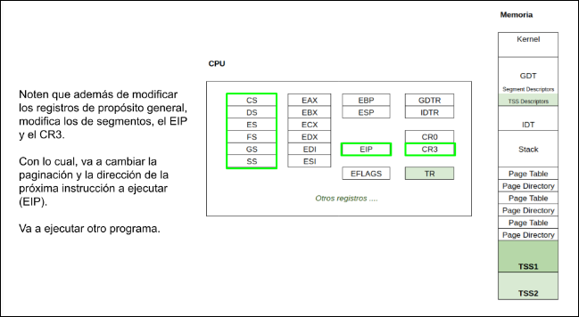

# System Programming

## Modo Real, Modo Protegido

### Propiedades
| Modos | Bits | Memoria | Privilegios | Interrupciones | Instrucciones |
| :---: | :--: | :-----: | :---------: | :------------: | :-----------: |
| Real | 16 | 1 MB | - | Rutinas de atencion | Todas |
| Protegido | 32 | 4 GB | 4 niveles | Rutinas de atencion con privilegios | Depende del privilegio |

### Pasaje a Modo Protegido
Para pasar a modo protegido, necesitamos
- Un bootloader
- Armar la GDT
- Desabilitar interrupciones
- Cargar en la GDTR la direccion base de la GDT
- Setear el bit PE del registro CR0
- `FAR JMP` a la siguiente instruccion
- Cargar los selectores de segmento

#### Bootloader comun
1. CPU ejecuta codigo residente en memoria flash de BIOS
2. BIOS ejecuta POST en los dispositivos
3. BIOS busca un dispositivo booteable
4. Se copia a memoria principal en la posicion `0x7C00` el sector de booteo (512 bytes)


#### Bootloader Orga2
1. Se copia el bootloader a la posicion `0x1000`
2. Busca y carga el archivo `kernel.bin` contenido en el diskette y lo copia en la direccion `0x1200`
3. Se salta hacia la direccion `0x1200` y se ejecuta desde ahi


#### Segmentacion
La segmentacion se compone de varias partes
- Selector de Segmentos
- Descriptor Table
- Base Address
- Offset
- Linear Address

##### Selector de Segmentos


Un selector de segmentos tiene un tamaño de 16 bits y de divide en 3 partes
- `Index`
    * Es el indice en la tabla de descriptores. 
    * Al tener 13 bits, se puede deducir que cada tabla puede alojar hasta 2^13^ descriptores.
- `TI`
    * Table Indicator.
    * `TI = 0`, **GDT** (Global Descriptor Table) :point_left:
    * `TI = 1`, **LDT** (Local Descriptor Table)
- `RPL`
    * Requested Priviledge Level
    * Es el nivel de privilegio que declara tener el dueño del segmento.
    * `RPL = 00`, :sunglasses:
    * `RPL = 11`, :nerd_face:

En un CPU `x86` hay varios selectores de segmentos que se diferencian de acuerdo
a lo almacenan
| Segmento | Acceso |
| :------: | :----: |
| `CS` | Codigo |
| `SS` | Pila |
| `DS` | Datos (default) |
| `ES` | Datos |
| `FS` | Datos |
| `GS` | Datos |

##### Descriptor de Segmentos
Un descriptor de segmentos tiene un tamaño de 64 bits y se divide de la siguiente manera


- `Base Address`
    * Es la direccion a partir de la cual se despliega en forma continua el segmento
- `Segment Limit`
    * Especifica el maximo offset que puede tener un byte direccionable dentro del segmento
    * Es el tamaño del segmento menos 1
- `G`
    * *Granularity*
    * Establece la unidad de medida del `Segment Limit`
    * `G = 0`, el maximo offset de un byte es igual al `Segment Limit`
    * `G = 1`, el maximo offset es igual a `Segment Limit * 0x1000 + 0xFFF` :point_left:
- `D/B`
    * *Default/Big*
    * Configura el tamaño de los segmentos
    * `D/B = 0`, el segmento es de 16 bits
    * `D/B = 1`, el segmento es de 32 bits :point_left:
- `L`
    * Verifica si el segmento de codigo tiene un tamaño de 64 bits
        + Solamente lo mira cuando el CPU esta en modo `IA-32e` (x64)
    * `L = 0` :point_left:
- `AVL`
    * *Available*
    * Es un bit que queda para el programador
    * `AVL = 0` :point_left:
- `P`
    * *Present*
    * `P = 1`, el segmento correspondiente esta presente en la memoria RAM :point_left:
    * `P = 0`, el segmento esta en la memoria virtual (disco)
- `DPL`
    * *Descriptor Priviledge Level*
    * Nivel de privilegio que debe tener el segmento que contiene el codigo que pretende acceder a este segmento
    * `DPL = 00`, :sunglasses:
    * `DPL = 11`, :nerd_face:
- `S`
    * *System*
    * `S = 0`, adminstra los segmentos de Sistema
    * `S = 1`, adminstra los segmentos de Codigo/Datos :point_left:

##### Tipos de Descriptores de Dato (`S = 1`)
| Decimal | 11 | 10 (`E`) | 9 (`W`) | 8 (`A`) | Descripcion |
| :-----: | :-: | :-----: | :-----: | :-----: | :---------: |
| 0       | 0  | 0        | 0       | 0       | Read-Only   |
| 1       | 0  | 0        | 0       | 1       | Read-Only, Accessed |
| 2       | 0  | 0        | 1       | 0       | Read/Write  |
| 3       | 0  | 0        | 1       | 1       | Read/Write, Accessed |
| 4       | 0  | 1        | 0       | 0       | Read-Only, Expand-down |
| 5       | 0  | 1        | 0       | 1       | Read-Only, Expand-down, Accessed |
| 6       | 0  | 1        | 1       | 0       | Read/Write, Expand-down |
| 7       | 0  | 1        | 1       | 1       | Read/Write, Expand-down, Accessed |

##### Tipos de Descriptores de Codigo (`S = 1`)
| Decimal | 11 | 10 (`C`) | 9 (`R`) | 8 (`A`) | Descripcion |
| :-----: | :-: | :-----: | :-----: | :-----: | :---------: |
| 8       | 1  | 0        | 0       | 0       | Execute-Only   |
| 9       | 1  | 0        | 0       | 1       | Execute-Only, Accessed |
| 10      | 1  | 0        | 1       | 0       | Execute/Read  |
| 11      | 1  | 0        | 1       | 1       | Execute/Read, Accessed |
| 12      | 1  | 1        | 0       | 0       | Execute-Only, Conforming |
| 13      | 1  | 1        | 0       | 1       | Execute-Only, Conforming, Accessed |
| 14      | 1  | 1        | 1       | 0       | Execute/Read, Conforming |
| 15      | 1  | 1        | 1       | 1       | Execute/Read, Conforming, Accessed |

Significados de los bits de `Types`
- `C`
    * *Conforming*
    * Ajuntan su nivel de privilegio al del codigo que los ha invocado
    * Permiten que un segmento de codigo pueda ser invocado desde otro segmento de codigo menos privilegiado mediante, por ejemplo, una instruccion `CALL` a una subrutina residente en este segmento
- `R`
    * *Readable*
    * `R = 1`, habilita la lectura de direcciones de memoria residente en el segmento
- `E`
    * *Expand-Down*
    * Cuando el segmento de datos va a ser utilizado como Pila, puede optarse por tratarlo como un segmento comun de datos.
    * Pone de manifiesto que es una Pila y su puntero de direcciones decrece hacia las direcciones de memoria numericamente menores a medidda que se expande el segmento.
- `W`
    * *Writable*
    * `W = 0`, solamente puede leerse el segmento de datos
    * `W = 1`, habilita la escritura del segmento de datos
- `A`
    * *Accessed*
    * Se setea cada vez que se accede una direccion en el segmento

##### GDT


Como pasar de Direccion Logica a Direccion Lineal
1. El procesador evalua el estado del bit 2 del sector y en caso de que `TI = 0`, el procesador asume que buscara el descriptor en la tabla **GDT**
2. El registro **GDTR** del procesador contiene la *direccion fisica* en donde comienza la **GDT**
3. El valor `n` contenido por los 13 bits del campo `Index` del selector, referencia al n-esimo elemento de la tabla **GDT**
4. El procesador accede a la direccion de *memoria fisica* dada por `GDT.Base + 8 * Index` y lee 8 bytes a partir de ella
5. Una vez leido el descriptor, internamente reordena la *direccion base* y el *limite* y agrupa los *atributos*
6. La Unidad de Proteccion verifica que el offset contenido en el registro correspondiente de la *direccion logica* corresponda al rango de offsets validos del segmento de acuerdo al valor del campo *limite* y de los bits de *Atributos* `G`, `D/B` y `ED`
7. La Unidad de Proteccion chequea que la operacion a realizarse en el segmento se corresponda con los bits de *Atributos* `R` y `C`, si es de codigo, `W` si es de datos, que el codigo de acceso tenga los privilegios necesarios de acuerdo a los bits `DPL` del descriptor, que `P = 1`, entre los mas comunes
8. Si todo esta de manera correcta, el procesador suma el valor de offset contenido en la *direccion logica*, con la *direccion base* del segmento y conforma la *direccion lineal*

##### LDT


# Interrupciones

## Que son las interrupciones y para que las usamos?
- Conceptualmente permite a un agente externo o interno solicitar la interrupcion de la ejecucion actual para atender un pedido
- La parte solicitante ve al procesador como un recurso al cual quiere tener acceso
- El mecanismo implementado **define una identidad numerica para cada interrupcion** y utiliza una tabla de descriptores donde cada indice, o identidad, se decide:
    * Donde se encuentra la rutina que lo atiende (direccion de memoria)
    * En que contexto se va a ejecutar (segmento y nivel de privilegio)
    * De que tipo de interrupcion se trata

## Tipos de Interrupciones
- **Excepciones** que van a ser generadas por el procesador cuando se cumpla una condicion, por ejemplo si se quiere acceder a una direccion de memoria a traves de un selector cuyo segmento tiene el bit `P` apagado
- **Interrupciones**
    * **Externas**, cuyo origen se da en un dispositivo externo (reloj y teclado)
    * **Internas**, cuyo origen se da en una llamada a la instruccion `INT` por parte de un proceso

## Tipos de Excepciones
- **Fault**, excepcion que podria corregirse para que el programa continue su ejecucion. El procesador guarda en la pila la direccion de la instruccion que produjo la falla
- **Traps**, excepcion producida al terminar la ejecucion de una instruccion de trap. El procesador guarda en la pila la direccion de la instruccion a ejecutarse luego de la que causo el trap
- **Aborts**, excepcion que no siempre puede determinar la instruccion que la causa, ni permite recuperar la ejecucion de la tarea que la causo. Reporta errores severos de hardware o inconsistencias en tablas del sistema

## Implementacion
- Escribir la rutina de atencion de cada excepcion/interrupcion (`IRET`)
- Definir la *IDT* con los descriptores correspondientes
- Cargar nuestro descriptor de *IDT* en `IDTR`

### Estado de la pila
Antes de atender una excepcion/interrupcion, el procesador pushea en la pila
- `EFLAGS`
- `CS`
- `EIP`
- En algunas excepciones tambien un error code

#### Pila sin error code


#### Pila con error code
Si la excepcion o la interrupcion se ha producido en medio del codigo de una aplicacion (modo user), sera el kernel quien tome control.
Si se genero en codigo del kernel, queda en el kernel


- `EXT`
    * *External Event*
    * Se setea para indicar que al excepcion ha sido causada por un evento externo al procesador
- `IDT`
    * Descriptor Location
    * `IDT = 0`, los bits 15:3 indican el descriptor de la tarea actual
- `TI`
    * `IDT = 0`
        + `TI = 0`, indican a una GDT
        + `TI = 1`, indican a una LDT

##### Copia del Stack Usuario al Stack Kernel


### Estructura de la IDT


#### Descriptor de Interrupciones


- `Offset`, va a ser la direccion de memoria donde comienza la rutina de atencion de interrupcion
- `Segment selector`, indica que selector debe utilizarse al ejecutar el codigo de la rutina
- `P`, indica si la rutina se encuentra en memoria o no
- `DPL`, indica el nivel de privilegio

### Esquema general


# Paginacion
La funcion de la paginacion es la de traducir una direccion virtual en una direccion fisica. Esta traduccion permite separar el espacio de direcciones expuestas al proceso (dir. virtuales) de su ubicacion en la memoria fisica (dir. fisicas en la memoria principal).

Dividir el espacio de direcciones virtuales del espcacio fisico tiene la ventaja de poder separar el espacio de distintos procesos que se ejecutan sobre el mismo procesador y por ende comparten una misma memoria principal. 

## Traduccion de direcciones virtuales
En la direccion virtual, encontraremos las herramientas necesarias para encontrar la pagina de 4K que necesitamos.
La misma se divide en tres partes
- `PD_Index`
    * *PageDirectory_Index*
    * Indice dentro del **Page Directory** donde se encuentra la ubicacion del **Paga Table**
    * Bits 31:22
- `PT_Index`
    * *PageTable_Index*
    * Indice dentro del **Paga Table** donde se encuentra la ubicacion del **Page Frame**
    * Bits 21:12
- `Page_Offset`
    * Desplazamiento desde la base de la pagina donde se encuentra el dato esperado
    * Bits 11:0


### CR3


- `Address of page directory`
    * Direccion donde se encuentra el **Page Directory**
    * Direccion del directorio: `CR3 & 0xFFFFF000`
- `PWT`
    * *Page-Level Write Through*
    * Establece el modo de escritura que tendra la pagina en el Cache
    * `PWT = 0` :point_left:
- `PCD`
    * *Page-Level Cache Disable*
    * Establece que una pagina integre el tipo de memoria no cacheable
    * `PCD = 0` :point_left:

### Page Directory Entry


- `Address of page table`
    * Direccion donde se encuentra el **Page Table**
    * Direccion del i-esima tabla: `pd[i] & 0xFFFFF000`
- `PS`
    * *Page Size*
    * `PS = 0` :point_left:
        + La **Page Directory Entry** corresponde a una **Page Table** de 4K
    * `PS = 1`
        + La **Page Directory Entry** corresponde a una **Page Table** de 4M
    * Bit 7
- `A`
    * *Accessed*
    * Se setea cada vez que la pagina es accedida
    * Se limpia por soft
- `U/S`
    * *User/Supervisor*
    * Privilegio de la pagina
    * `U/S = 0` :sunglasses:
    * `U/S = 1` :nerd_face:
- `R/W`
    * *Readable/Writable*
    * `R/W = 0`, Read-Only
    * `R/W = 1`, Read/Write

### Page Table Entry


- `Address of 4K page frame`
    * Direccion donde se encuentra el **Page Frame**
    * Direccion de la i-esima pagina: `pt[i] & 0xFFFFF000`
- `D`
    * *Dirty*
    * Es seteado por unidad de memoria del procesador cuando se escribe en la pagina
    * Se limpia por soft
- `G`
    * *Global*
    * Si el bit `CR4.PGE = 1`, la entrada no se flushea cuando se recarga el registro `CR3`
- `P`
    * *Present*
    * Indica si la pagina se encuetra en memoria (`P = 1`) o no (`P = 0`)

## Translation Lookaside Buffer
Almacena las ultimas traducciones realizadas para no tener que volver a computarlas.
Cuando se realiza un cambio en la estructura de paginacion, es necesario forzar una limpieza del mismo para evitar que las direcciones pre-computadas que ya no son validas se sigan empleando, para esto realizamos un intercambio del registro `CR3` con un valor temporal y luego lo restauramos


## Segmentacion + Paginacion


# Tareas

## Definiciones
- Tarea
    * Es una unidad de trabajo que el procesador puede despachar, ejecutar y suspender. Puede ser usada para ejecutar un programa
    * Dos o mas tareas distintas pueden tener un mismo codigo de programa, sin embargo, sus contexto de ejecucion y datos asociados pueden ser distintos. Podemos pensarlo como distintas instancias del mismo programa.
- Espacio de Ejecucion
    * Paginas mapeadas donde va a tener el codigo, datos y pilas
- Segmento de Estado
    * *Task State Segment*
    * Una region de memoria que almacena el estado de una tarea, a la espera de iniciarse o al momento de ser desalojada del procesador, y con un formato especifico para que podamos iniciarla/reanudarla
    * La informacion que se va a guardar en esta region seria
        + Registros de proposito general
        + Registros de segmento de la tarea y segmento de la pila de nivel 0
        + Flags
        + `CR3`
        + `EIP`
- Scheduler
    * Modulo de software que administra la ejecucion de tareas/procesos
    * Utiliza una politica o criterio para decir cual es la proxima tarea a ejecutar
- Context Switch
    * Salvar y restaurar el estado computacional o contexto de dos procesos o threads cuando se suspende la ejecucion del primero (se salva su contexto) para pasar a ejecutar el segundo (se restaura su contexto)
    * Puede incluir, o no, el resguardo y restauracion del espacio de memoria (procesos o threads)
- Task Register
    * Almacena el selector de segmento de la tarea en ejecucion

## Estructura


### TSS
Guada una foto del contexto de ejecucion de la tarea. Al crear la tarea, hay que setear los valores iniciales.


Para inicializar la TSS de una tarea, tenemos que completar con la informacion inicial que posibilite la correcta ejecucion de la tarea.
Es decir, los valores que va a tener son aquellos que se van a cargar en los registros de CPU y que usara en la ejecucion.
Campos mas relevantes a completar
- `EPI`
- `ESP`, `EBP` y `ESP0`
- `CS`, `DS`, `ES`, `FS`, `GS`, `SS`, `SS0`
- `CR3` que va tener la paginacion asociada a la tarea. Cada tarea tiene su propio directorio de paginas
- `EFLAGS` en `0x00000202` para tener las interrupciones habilitadas

### TSS Descriptor


- `B`
    * *Busy*
    * Indica si la tarea esta siendo ejecutada
    * Se inicializa `B = 0`
- `DPL`
    * Nivel de privilegio que se precisa para *acceder al segmento*
    * `DPL = 0` :sunglasses:
    * `DPL = 1` :nerd_face:
- `LIMIT`
    * Es el tamaño de la TSS. `0x67` es el minimo requerido
- `BASE`
    * Indica la direccion base de la TSS

## Task Switch
El procesador puede despachar una tarea de las siguientes maneras
- Por medio de una instruccion `CALL`
- Por medio de una instruccion `JMP`
- Mediante una llamada implicita del procesador al handler de una interrupcion manejo por una tarea
- Mediante una llamada implicita del procesador al handler de una excepcion manejado por una tarea
- Mediante la ejecucion de la instruccion `IRET` en una tarea cuando el flag `NT` (bit 14 del registro `EFLAGS`) es `1` para la tarea actual

### Como hacer un Task Switch?

#### Paso 1


#### Paso 2


#### Paso 3


#### Paso 4


#### Paso 5


#### Paso 6


#### Paso 7



### Rutina de Atencion de Interrupicones del Reloj
```asm
; La estructura definida se puede ver como una
; direccion logica de 48 bits en little endian
%define offset: dd 0
%define selector: dw 0

global _isr32

_isr32:
    ; Guarda los registros de proposito general
    pushad

    ; Indica al PIC que la interrupcion fue atendida
    call pic_finish1

    ; Intercambio de tareas!!
    ; Pide al scheduler la proxima tarea a ejecutar.
    ; Devuelve la proxima tarea con el valor guardado en ax.
    ; El metodo sched_nextTask del scheduler devuelve en ax 
    ; el selector de segmento de la proxima tarea a ejecutar.
    ; Los selectores tiene 16 bits por eso usa ax y no eax.
    call sched_nextTask
    ; STR lee el registro TR y lo guarda en cx.
    ; Ahora cx va a tener el valor del selector del segmento 
    ; de la tarea en ejecucion.
    str cx
    ; ax <- selector de segmento de la tarea proxima
    ; cx <- selector de segmento de la tarea actual (en ejecucion)
    cmp ax, cx
    ; Si la tarea en ejecucion es la misma que la misma que la proxima
    ; (ax = cx), salta a fin y no hay cambio de tarea.
    ; Si son distintas, ejecuta las siguientes lineas
    je .fin.
    ; Donde mueve el valor de ax a la posicion de memoria reservada
    ; para el selector.
    ; Y luego, hace un jmp far al contenido de la direccion indicada
    ; por el offset.
    ; Dicho jump recive una direccion logica de 48 bits.
    ; selector: dw 0 -> selector: tiene el valor de ax
    mov [selector], ax
    ; Salta al selector de TSS en la GDT de la tarea proxima retornada por el scheduler.
    ; Cambia la tarea y automaticamente se dispara el cambio de contexto.
    ; Esto es valido ya que, cuando se hace un jmp far,
    ; no importa el valor del offset sino el valor de ax
    ; (en este caso el selector TSS) donde va a saltar.
.fin:
    ; Obtiene los registros de proposito general.
    popad
    ; Volver a la rutina que la llamo restaurando el EIP.
    iret
```

### Niveles de Privilegios en Tareas
Una tarea ejecutando en nivel 0 indicado por su `ss` y `se` produce la interrupcion de reloj. El nivel de ejecucion no cambia dado que la interrupcion de reloj es nivel 0.

Ahora, si tenemos una tarea ejecutando en nivel 3 indicado por su `ss` y se produce la interrupción de reloj. El nivel de ejecución cambia. Por lo tanto, usa la pila de nivel 0 (`ss0`) indicada en la TSS para guardar la información de retorno.

Cuando hay niveles de privilegios distintos, la `ss` y `esp` del procesador siempre toma la del nivel de ejecución actual.

Ejecutando una tarea de nivel 3 y justo se produjo una interrupción de nivel 0. Si se produce un cambio de contexto, la TSS de una tarea de nivel 3 podría quedar con un ss almacenado de nivel 0.

Los valores nivel 3 quedan en la pila y se restaurarán en el `iret` correspondiente.
