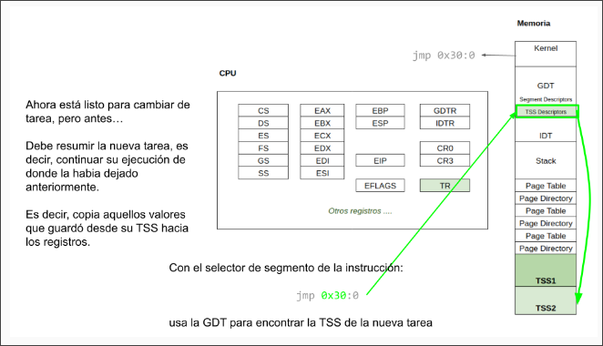

# Tareas

## Definiciones
- Tarea
    * Es una unidad de trabajo que el procesador puede despachar, ejecutar y suspender. Puede ser usada para ejecutar un programa
    * Dos o mas tareas distintas pueden tener un mismo codigo de programa, sin embargo, sus contexto de ejecucion y datos asociados pueden ser distintos. Podemos pensarlo como distintas instancias del mismo programa.
- Espacio de Ejecucion
    * Paginas mapeadas donde va a tener el codigo, datos y pilas
- Segmento de Estado
    * *Task State Segment*
    * Una region de memoria que almacena el estado de una tarea, a la espera de iniciarse o al momento de ser desalojada del procesador, y con un formato especifico para que podamos iniciarla/reanudarla
    * La informacion que se va a guardar en esta region seria
        + Registros de proposito general
        + Registros de segmento de la tarea y segmento de la pila de nivel 0
        + Flags
        + `CR3`
        + `EIP`
- Scheduler
    * Modulo de software que administra la ejecucion de tareas/procesos
    * Utiliza una politica o criterio para decir cual es la proxima tarea a ejecutar
- Context Switch
    * Salvar y restaurar el estado computacional o contexto de dos procesos o threads cuando se suspende la ejecucion del primero (se salva su contexto) para pasar a ejecutar el segundo (se restaura su contexto)
    * Puede incluir, o no, el resguardo y restauracion del espacio de memoria (procesos o threads)
- Task Register
    * Almacena el selector de segmento de la tarea en ejecucion

## Estructura


### TSS
Guada una foto del contexto de ejecucion de la tarea. Al crear la tarea, hay que setear los valores iniciales.


Para inicializar la TSS de una tarea, tenemos que completar con la informacion inicial que posibilite la correcta ejecucion de la tarea.
Es decir, los valores que va a tener son aquellos que se van a cargar en los registros de CPU y que usara en la ejecucion.
Campos mas relevantes a completar
- `EPI`
- `ESP`, `EBP` y `ESP0`
- `CS`, `DS`, `ES`, `FS`, `GS`, `SS`, `SS0`
- `CR3` que va tener la paginacion asociada a la tarea. Cada tarea tiene su propio directorio de paginas
- `EFLAGS` en `0x00000202` para tener las interrupciones habilitadas

### TSS Descriptor


- `B` *Busy*
    * Indica si la tarea esta siendo ejecutada
    * Se inicializa `B = 0`
- `DPL`
    * Nivel de privilegio que se precisa para *acceder al segmento*
        + `DPL = 0` :sunglasses:
        + `DPL = 1` :nerd_face:
- `LIMIT`
    * Es el tamaño de la TSS. `0x67` es el minimo requerido
- `BASE`
    * Indica la direccion base de la TSS 

## Task Switch
El procesador puede despachar una tarea de las siguientes maneras
- Por medio de una instruccion `CALL`
- Por medio de una instruccion `JMP`
- Mediante una llamada implicita del procesador al handler de una interrupcion manejo por una tarea
- Mediante una llamada implicita del procesador al handler de una excepcion manejado por una tarea
- Mediante la ejecucion de la instruccion `IRET` en una tarea cuando el flag `NT` (bit 14 del registro `EFLAGS`) es `1` para la tarea actual

### Como hacer un Task Switch?

#### Paso 1


#### Paso 2


#### Paso 3


#### Paso 4


#### Paso 5



#### Paso 6


#### Paso 7


### Rutina de Atencion de Interrupciones del Reloj
```asm
; La estructura definida se puede ver como una
; direccion logica de 48 bits en little endian
%define offset: dd 0
%define selector: dw 0

global _isr32

_isr32:
    ; Guarda los registros de proposito general
    pushad

    ; Indica al PIC que la interrupcion fue atendida
    call pic_finish1

    ; Intercambio de tareas!!
    ; Pide al scheduler la proxima tarea a ejecutar.
    ; Devuelve la proxima tarea con el valor guardado en ax.
    ; El metodo sched_nextTask del scheduler devuelve en ax 
    ; el selector de segmento de la proxima tarea a ejecutar.
    ; Los selectores tiene 16 bits por eso usa ax y no eax.
    call sched_nextTask

    ; STR lee el registro TR y lo guarda en cx.
    ; Ahora cx va a tener el valor del selector del segmento 
    ; de la tarea en ejecucion.
    str cx

    ; ax <- selector de segmento de la tarea proxima
    ; cx <- selector de segmento de la tarea actual (en ejecucion)
    cmp ax, cx

    ; Si la tarea en ejecucion es la misma que la misma que la proxima
    ; (ax = cx), salta a fin y no hay cambio de tarea.
    ; Si son distintas, ejecuta las siguientes lineas
    je .fin

    ; Donde mueve el valor de ax a la posicion de memoria reservada
    ; para el selector.
    ; Y luego, hace un jmp far al contenido de la direccion indicada
    ; por el offset.
    ; Dicho jump recive una direccion logica de 48 bits.
    ; selector: dw 0 -> selector: tiene el valor de ax
    mov [selector], ax

    ; Salta al selector de TSS en la GDT de la tarea proxima retornada por el scheduler.
    ; Cambia la tarea y automaticamente se dispara el cambio de contexto.
    ; Esto es valido ya que, cuando se hace un jmp far,
    ; no importa el valor del offset sino el valor de ax
    ; (en este caso el selector TSS) donde va a saltar.
    jmp far [offset]

.fin:
    ; Obtiene los registros de proposito general.
    popad
    ; Volver a la rutina que la llamo restaurando el EIP.
    iret
```


### Niveles de Privilegios en Tareas
Una tarea ejecutando en nivel 0 indicado por su `ss` y `se` produce la interrupcion de reloj. El nivel de ejecucion no cambia dado que la interrupcion de reloj es nivel 0.

Ahora, si tenemos una tarea ejecutando en nivel 3 indicado por su `ss` y se produce la interrupción de reloj. El nivel de ejecución cambia. Por lo tanto, usa la pila de nivel 0 (`ss0`) indicada en la TSS para guardar la información de retorno.

Cuando hay niveles de privilegios distintos, la `ss` y `esp` del procesador siempre toma la del nivel de ejecución actual.

Ejecutando una tarea de nivel 3 y justo se produjo una interrupción de nivel 0. Si se produce un cambio de contexto, la TSS de una tarea de nivel 3 podría quedar con un ss almacenado de nivel 0.

Los valores nivel 3 quedan en la pila y se restaurarán en el `iret` correspondiente.


